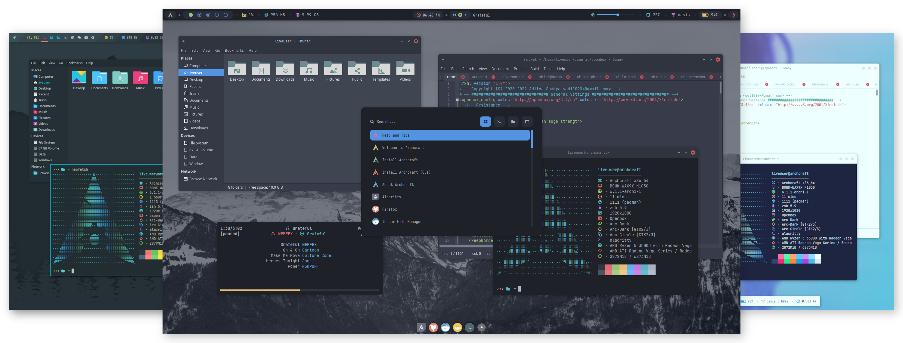

	

<h4 align="center">Yet another minimal linux distribution, based on <a href="https://www.archlinux.org">Arch Linux</a>.</h4>

	
	
	
	
	
	
	

	Archcraft is an <b>arch-based</b> rolling-release distribution aimed at users who cares more about <b><i>minimalism and aesthetics</i></b> of their desktop. It comes pre-configured with various lightweight applications which makes it super fast. It can run under 500Mb of memory. There are two window managers installed by default, <b>Openbox</b> and <b>Bspwm</b>.

